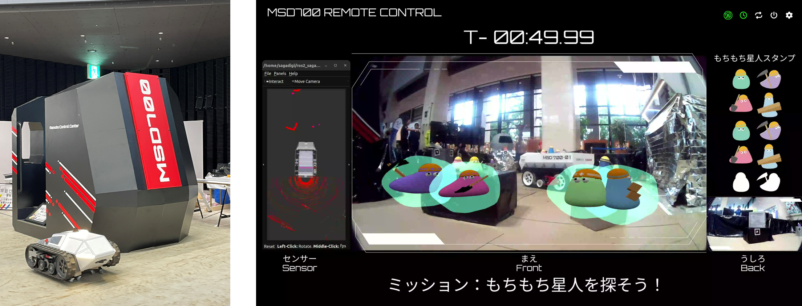

# 小型建機遠隔操作システム 

本プロジェクトはアルバイト業務の一環として開発されたものです。
守秘義務によりソースコードは公開していませんが、以下に担当範囲と技術概要を記載します。

## プロジェクト概要 (Overview)
遠隔地にある小型探査機をコックピットから操縦し、迷子になったキャラクター（もちもち星人）を探し出すゲーミフィケーションコンテンツです。
Webブラウザ上で動作する操縦インターフェースを開発し、探査機からのカメラ映像をリアルタイムで受信・表示するシステムを構築しました。

## 担当範囲 (My Role)
* **開発期間**: 1ヶ月
* **役割**: WebRTC通信の実装（1名）、Webページ作成（2名）
* **担当領域**:
    * 複数カメラ映像（前後）のリアルタイム受信処理の実装
    * ARマーカー認識とコンテンツ表示ロジックの実装

### フロントエンド / UI
* **HTML5 / CSS3 / JavaScript**
    * 操縦用コックピット画面（GUI）の構築。
    * 複数の映像ストリームを配置し、操作性を考慮したレスポンシブなレイアウトを実装。

### 通信 / 映像処理
* **WebRTC (Real-Time Communication)**
    * 探査機の前方・後方カメラからの映像を、遅延なくブラウザに伝送するために採用。
    * **1名で実装を担当**し、シグナリングサーバーを介したP2P接続の確立、複数ストリームの同時処理を行いました。

### 拡張現実 (AR)
* **AR.js**
    * Webブラウザ上で動作する軽量なARライブラリとして採用。
    * カメラ映像内のマーカーを認識し、3Dオブジェクト（キャラクター）やスタンプ画像をオーバーレイ表示させる処理を実装。

## 技術的なこだわり (Key Highlights)

### 1. 運転操作を阻害しないUX設計
AR表示が運転の邪魔にならないよう、認識状態に応じて表示スタイルを動的に変更するロジックを組み込みました。
* **通常時**: マーカー未検出時は何も表示しない。
* **発見時**: マーカーを認識するとキャラクターを表示するが、運転視界を確保するため**オブジェクトの透明度を下げて表示**する工夫を取り入れました。

### 2. 複数映像の最適配置
前方映像（メイン）と後方映像（サブ）のサイズ比率を調整し、バック走行時にも視認性を確保できる画面レイアウトを設計しました。

### 3. ゲーム要素の同期処理
ARマーカー認識イベントをトリガーとして、画面上の「スタンプ帳」UIを更新する非同期処理をJavaScriptで実装し、映像とUIのシームレスな連携を実現しました。
